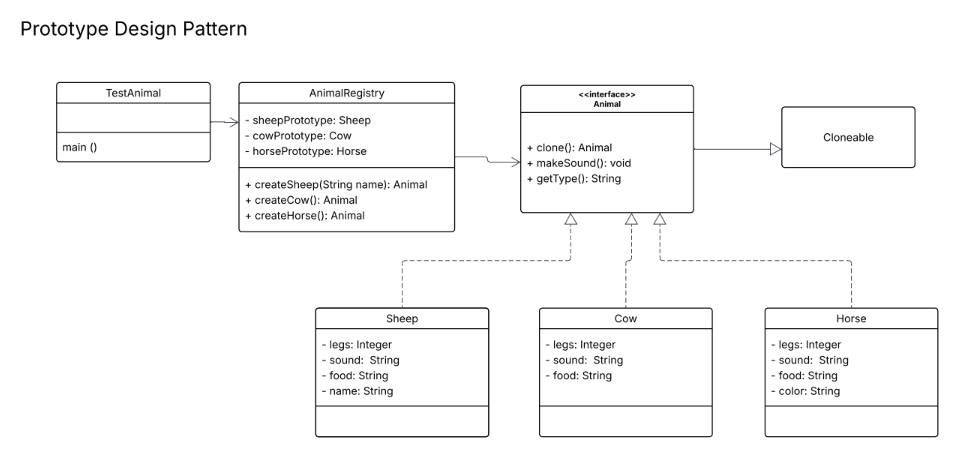

# Prototype3CS-2

# Prototype Design Pattern - Animal Registry

A Java implementation of the **Prototype Design Pattern** using a farm animal registry.

## Pattern Overview

The Prototype Pattern creates new objects by **cloning** an existing object (the prototype) instead of creating new instances from scratch. This is useful when object creation is costly or complex.

## Project Structure
prototype3CS-2/
├── Animal.java          # Interface for all animals
├── Sheep.java           # Concrete prototype - Sheep
├── Cow.java             # Concrete prototype - Cow
├── Horse.java           # Concrete prototype - Horse
├── AnimalRegistry.java  # Registry that stores and clones prototypes
└── TestAnimal.java      # Main class / entry point

## Class Diagram

| Class | Role |
|-------|------|
| `Animal` | Interface with `clone()`, `makeSound()`, `getType()` |
| `Sheep` | Implements Animal, has `name` field |
| `Cow` | Implements Animal, has `sound` field |
| `Horse` | Implements Animal, has `color` field |
| `AnimalRegistry` | Stores prototypes and returns clones |
| `TestAnimal` | Client that uses the registry |

### Requirements
- Java 17 or higher

